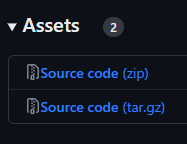

# Cinema Kiosk System
<!-- https://joeccp.github.io/SBA/ -->

## Introduction
Welcome! This is a **Cinema Kiosk System** project for 
the Hong Kong Diploma of Secondary Education Examination 2024 
Information and Communication Technology Elective Part D - Software Development 
School-based Assessment.

This project is a simple simulation of a cinema movie ticket system.
This Cinema Kiosk System provides an easy way for customers 
to buy movie tickets. 
It also serves the administrator as a control platform.

This project is solely done by **Joe Chau**.

Scripts are written WITHOUT any help of 
generative artificial intelligence such as ChatGPT or GitHub Copilot.

This project has *NO PRACTICAL USE*, this is just a piece of high school homework :)

*If you are reading this from the GitHub repository, 
you may want to check out the online version of this documentation instead: <https://joeccp.github.io/SBA/>*

## Getting started

### Requirements
- Python 3.11.0 or higher

This program mainly serves Windows 10 and Windows 11. 
But should also support Linux (roughly tested on Debian GNU/Linux 12 (bookworm) on Windows 11 x86_64 with WSL2).

### Download
You can find the latest release [here](https://github.com/Joeccp/SBA/releases/latest), 
Under `Assests`, you can choose to download the `.zip` file or the `.tar.gz` file, as follows:

In most of the cases, you would like to download the first one. 
After the download is completed, unzip it.

### Usage
Run this package using Python via `cmd`/`powershell` with the `-m` flag, or directly run the `__main__.py`

(Do NOT run this program on a Python terminal *inside* an IDE, it will NOT work.)

### Examples
0. (Download python 3.11 or above)
1. Download the source code (the `zip` file).
2. Unzip it.
3. Inside the unzipped folder, you should see another folder with the same name, open it.
4. Double-click the `__main__.py` file. 
(Or the `__main__` file if you cannot see the file extension.)
5. Ta-da!

# Report
A rough SBA report can be found [here](report/REPORT.md). NOT THE FINAL VERSION. Work in progress.

## Documentations

*Documentation is only available in English.*
*文檔僅提供英文版。*

- User manual
    - [Login](docs/login.md)
    - [Admin Control Panel](docs/controlPanel.md)
    - [Admin seat operation](docs/seatStatusOverride.md)
    - [Cinema houses](docs/house.md)
    - [Colour scheme](docs/colour.md)
    - [Data Storage](docs/dataStorage.md)
    - [Language](docs/language.md)
    - [Ticket](docs/ticket.md)
- [Log files](docs/logs.md)

## Useful links
-  
[GitHub Repository](https://github.com/Joeccp/SBA) <-- The source code can be found here
-  
[Documentations](https://joeccp.github.io/SBA/)
-  
A rough [code documents](codedocs/src/index.html) generated with [pdoc](https://pdoc3.github.io/pdoc/).
FOR REFERENCE ONLY.

---

Copyright © 2023 Joe Chau, Licensed under the 
<a href="https://www.apache.org/licenses/LICENSE-2.0" target="_blank">Apache License, Version 2.0</a>.
