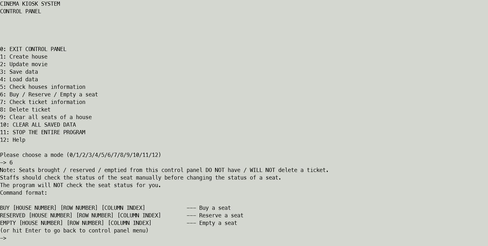

# Seat Operation for Administrator

Administrator can manually change the status of a seat.

This can be done by entering mode `6`(Buy / Reserve / Empty a seat) 
after login as **administrator**. 

## Warning :warning:
<b>
Any changes of seat by this mode will NOT affect the ticket system.
It means that manually setting a seat to be Sold, ticket will NOT be generated.
And turning a seat from Sold to Reserved/Empty will not delete any tickets.
Administrator is RECOMMENDED to check the status of the seat before changing it.
This mode will NOT check it for you. You will not be stopped when changing 
the seat status to the same as before.
</b>


## HOWTO: Change the seat status

Login as **administrator**, enter mode `6`(Buy / Reserve / Empty a seat).
You should see something like this:



If you want to change the seat to Sold, enter the following:
```
BUY [HOUSE NUMBER] [ROW NUMBER] [COLUMN INDEX]
```

If you want to change the seat to Reserved, enter the following:
```
RESERVE [HOUSE NUMBER] [ROW NUMBER] [COLUMN INDEX]
```

If you want to change the seat to Empty, enter the following:
```
Empty [HOUSE NUMBER] [ROW NUMBER] [COLUMN INDEX]
```

Replace [HOUSE NUMBER] to the house number of the seat;

replace [ROW NUMBER] to the row number of the seat; 

replace [COLUMN INDEX] to the column number of the seat. 

The command above is case-insensitive. Leading and trailing spaces are ignored.

You MUST NOT include the brackets (`[]`).

<br/><br/><br/>

---
<small>
The key words "MUST", "MUST NOT", "REQUIRED", "SHALL", "SHALL
NOT", "SHOULD", "SHOULD NOT", "RECOMMENDED", "NOT RECOMMENDED",
"MAY", and "OPTIONAL" in this document are to be interpreted as
described in 
<a href="https://www.rfc-editor.org/bcp/bcp14" target="_blank">BCP 14</a>
[<a href="https://www.rfc-editor.org/rfc/rfc2119" target="_blank">RFC2119</a>]
[<a href="https://www.rfc-editor.org/rfc/rfc8174" target="_blank">RFC8174</a>]
when, and only when, they
appear in all capitals, as shown here.
</small>

---

Copyright © 2023 Joe Chau, Licensed under the 
<a href="https://www.apache.org/licenses/LICENSE-2.0" target="_blank">Apache License, Version 2.0</a>.