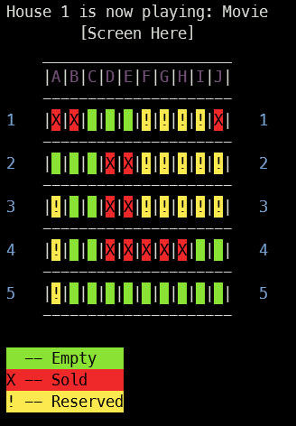
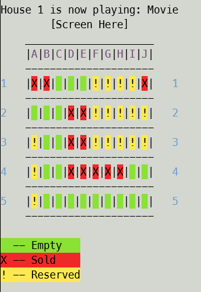

# Colour scheme

The colour scheme affects the font and background colour.

The status of the colour scheme is saved at `data/colour.txt`.

Every time this program is executed, it reads `data/colour.txt`
and load the corresponding colour scheme. 
If there is no such file, the program will create one for you.

## Colour schemes
There are two colour schemes: `DARK` and `LIGHT`.

Here is an example of the `DARK` colour scheme: 

Here is an example of the `LIGHT` colour scheme:

## HOWTO: Change the colour scheme
Login as **administrator**, enter mode `14`(Change the colour scheme).

The colour scheme will be changed to a **different** colour scheme and be saved.

---

Copyright © 2023 Joe Chau, Licensed under the 
<a href="https://www.apache.org/licenses/LICENSE-2.0" target="_blank">Apache License, Version 2.0</a>.