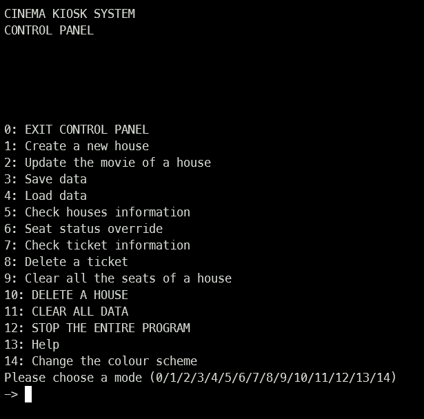

# Control Panel

Control Panel is available for administrator. It provides 10 back-end operations.
It can be accessed once you are logged in as administrator.

The menu of the control panel is like this:

You can do the following things by entering the respective 'mode' option:

| Mode | Action                                                           |
|:----:|:-----------------------------------------------------------------|
|  0   | Exit Control Panel and return to the login page                  |
|  1   | Create a cinema house                                            |
|  2   | Update the name of the currently playing movie of a cinema house |
|  3   | Save saved data                                                  |
|  4   | Load saved data                                                  |
|  5   | Check the information of different cinema houses                 |
|  6   | Manually buy/reserve/empty a seat                                |
|  7   | Check the information of a ticket                                |
|  8   | Delete a ticket                                                  |
|  9   | Clear (empty) all seat of a cinema house                         |
|  10  | Clear all (including saved) data                                 |
|  11  | Stop the entire program                                          |

